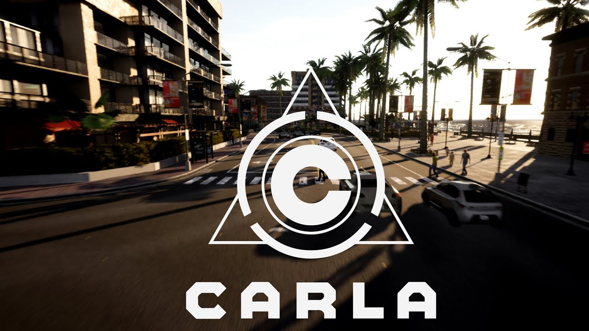

# Scientific research work (self-driving car)

<p align="center">
  
</p>

## Description

This repository is my research work in the field of self-driving cars for the Department of Automatic Control Systems ([IU-1](http://iu1.bmstu.ru/)) at Bauman Moscow State Technical University ([BMSTU](https://bmstu.ru/)).

To implement the software module for the synthesis of the trajectory of an autonomous unmanned vehicle, the [CARLA](https://github.com/carla-simulator/carla) autonomous driving simulator was selected - [official website](https://carla.org/).

To visualize the result, a HUD interface was written using the library [pygame](https://github.com/pygame/pygame), and also the full path of the car is drawn using the visualization of waypoints for a bird view.

## Example

 HUD view                  |      Bird view
:------------------------------:|:-------------------------:
https://youtu.be/hBpiEhYjVfU       | https://youtu.be/n9TGjnB6cDQ
<video src="video/Media1.mp4" width=500>     |  <video src="video/Media2.mp4" width=500>

To find the shortest path between two given points, the topological graph of the simulator's city map and the A* search from the library were used [NetworkX](https://github.com/NetworkX/NetworkX).

## Structure 

```Bash
../PythonAPI
│
├── carla/
    ├── agents/
        ├── navigation/
            ├── basic_agent.py
            ├── behavior_agent.py
            ├── behaviot_types.py
            ├── constant_velocity_agent.py
            ├── controller.py
            ├── global_route_planner.py
            ├── local_planner.py
        ├── tools/
            ├── misc.py 
    ├── dist/
    ├── scene_layout.py
├── example/
    ├── automatic_control.py
├── util/
```

## Installation

1. Install CARLA_0.9.14 - [Windows](https://github.com/carla-simulator/carla/releases/tag/0.9.14)
2. Clone this repository and replace the Python API directory of the CARLA simulator with the contents of this repository
3. Create virtual environment
```Bash
    - launch anaconda promt
    - conda create --name carla-sim python=3.7
    - activate carla-sim
```
4. Install dependencies
```Bash
    pip install carla
    pip install pygame
    pip install numpy
    pip install jupyter
    pip install opencv-python
```

## Launch

```Bash
    cd PythonAPI\examples
    python automatic_control.py
```

## Code description

To change the route of the car, it is necessary in the file automatic_control.py change this line of code to the required places of appearance and places of completion of the path

```Python
    destination = random.choice(spawn_points).location
```

For all questions related to the project, please write to AlexeyShevchenko03@yandex.ru.

